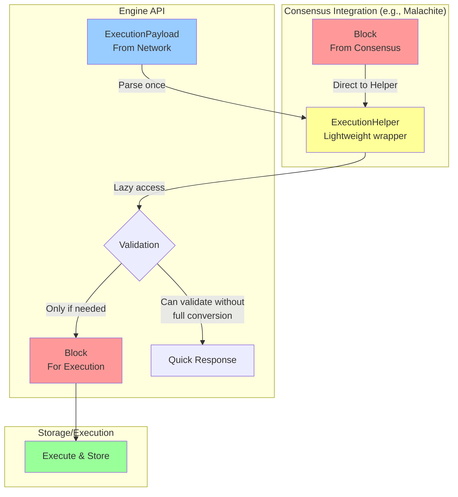

# Reth Helper Type Implementation Proposal

## Overview

This proposal introduces an intermediate "helper" type between ExecutionPayload and Block to eliminate the unnecessary block -> payload -> block roundtrip and provide more flexible payload processing for different blockchain implementations.

## Implementation Steps

### 1. Define Core Traits and Types

First, create the helper trait that serves as the intermediate representation:

```rust
// In reth-primitives or reth-payload-primitives
pub trait ExecutionHelper: Send + Sync + 'static {
    type Block: Block;
    type Transaction: Transaction;
    type Error: std::error::Error + Send + Sync + 'static;

    /// Convert to final block form
    fn into_block(self) -> Result<Self::Block, Self::Error>;

    /// Access transactions without full conversion
    fn transactions(&self) -> &[Self::Transaction];

    /// Get encoded payload bytes if available
    fn encoded_payload(&self) -> Option<&Bytes>;
}

/// Default implementation that wraps ExecutionPayload
pub struct DefaultExecutionHelper<P: PayloadTypes> {
    payload: P::ExecutionData,
    encoded: Option<Bytes>,
    // Cache decoded transactions to avoid re-decoding
    transactions: Option<Vec<RecoveredTx>>,
}
```

### 2. Update PayloadValidator Trait

Modify the existing `PayloadValidator` trait to use the helper:

```rust
pub trait PayloadValidator: Send + Sync + 'static {
    type Block: Block;
    type Helper: ExecutionHelper<Block = Self::Block>;

    /// Convert payload to helper (lightweight operation)
    fn payload_to_helper(&self, payload: ExecutionPayload) -> Result<Self::Helper, Error>;

    /// Validate the helper without full block conversion
    fn validate_helper(&self, helper: &Self::Helper) -> Result<(), Error>;

    /// Full validation with block conversion (for when needed)
    fn validate_and_convert(&self, payload: ExecutionPayload) -> Result<Self::Block, Error> {
        let helper = self.payload_to_helper(payload)?;
        self.validate_helper(&helper)?;
        helper.into_block()
    }
}
```

### 3. Create Specialized Implementations

For Ethereum:
```rust
pub struct EthExecutionHelper {
    header: Header,
    transactions: Vec<RecoveredTx>,
    ommers: Vec<Header>,
    withdrawals: Option<Vec<Withdrawal>>,
    requests: Option<Requests>,
    // Keep original payload for efficiency
    original_payload: Option<ExecutionPayload>,
}

impl ExecutionHelper for EthExecutionHelper {
    type Block = Block;
    type Transaction = TransactionSigned;
    type Error = PayloadError;

    fn into_block(self) -> Result<Block, Self::Error> {
        // Efficient conversion using pre-parsed data
        Ok(Block {
            header: self.header,
            body: BlockBody {
                transactions: self.transactions.into_iter().map(|tx| tx.into()).collect(),
                ommers: self.ommers,
                withdrawals: self.withdrawals,
                requests: self.requests,
            }
        })
    }
}
```

For Optimism (showing the benefit):
```rust
pub struct OpExecutionHelper {
    eth_helper: EthExecutionHelper,
    // Optimism-specific: keep encoded for efficiency
    encoded_txs: Vec<Bytes>,
    l1_attributes: Option<L1BlockInfo>,
}
```

### 4. Update Engine API Flow

Modify the engine's `new_payload` handling:

```rust
impl<V: PayloadValidator> EngineApi<V> {
    pub async fn new_payload(&self, payload: ExecutionPayload) -> PayloadStatus {
        // Step 1: Quick conversion to helper (cheap)
        let helper = match self.validator.payload_to_helper(payload) {
            Ok(h) => h,
            Err(e) => return PayloadStatus::invalid(e),
        };

        // Step 2: Pre-validation on helper (no full conversion)
        if let Err(e) = self.validator.validate_helper(&helper) {
            return PayloadStatus::invalid(e);
        }

        // Step 3: Only convert to block when needed for execution
        let block = match helper.into_block() {
            Ok(b) => b,
            Err(e) => return PayloadStatus::invalid(e),
        };

        // Continue with execution...
    }
}
```

### 5. Integration Points

Update `PayloadTypes` trait:
```rust
pub trait PayloadTypes {
    type ExecutionData;
    type BuiltPayload: BuiltPayload;
    type Helper: ExecutionHelper; // New associated type

    /// Direct conversion for efficiency
    fn block_to_helper(&self, block: SealedBlock) -> Self::Helper;

    /// Convert helper to payload for network transmission
    fn helper_to_payload(&self, helper: Self::Helper) -> Self::ExecutionData;
}
```

### 6. Migration Strategy

Create compatibility layer:
```rust
/// Adapter for existing code
impl<T: PayloadValidator> PayloadValidatorCompat for T {
    fn validate_payload(&self, payload: ExecutionPayload) -> Result<Block, Error> {
        self.validate_and_convert(payload)
    }
}
```

## Key Benefits

1. **Avoids full deserialization**: Helper can lazily decode only what's needed
2. **Preserves encoded data**: Useful for Optimism and other chains
3. **Flexible validation**: Can validate without full block construction
4. **Better performance**: Reduces allocations and conversions
5. **Extensible**: Different chains can have specialized helpers

## How This Eliminates the Block -> Payload -> Block Roundtrip

### Current Flow (With Roundtrip)


**Problems with current approach:**
1. **Double conversion**: Block is fully serialized to ExecutionPayload, then fully deserialized back to Block
2. **Performance overhead**: Unnecessary allocations and copies
3. **Inflexibility**: Can't preserve original encoded data (important for Optimism)

### New Flow (With Helper Type)



### Key Differences Explained

#### 1. **For Consensus Integration (Like Malachite)**
```rust
// OLD: Forced roundtrip
let payload = block_to_payload(block.clone());  // Block -> Payload
let block_again = payload.try_into_block()?;    // Payload -> Block
engine.execute(block_again)?;                    // Execute the reconstructed block

// NEW: Direct path
let helper = block_to_helper(block);            // Block -> Helper (cheap wrap)
engine.validate_and_execute(helper)?;            // No reconstruction needed
```

#### 2. **For Network Payloads**
```rust
// OLD: Always full conversion
let block = payload.try_into_block()?;          // Full deserialization
validator.validate(&block)?;                     // Validate
if valid { executor.execute(block)?; }           // Execute

// NEW: Lazy conversion
let helper = payload_to_helper(payload)?;        // Partial parse
validator.validate_helper(&helper)?;             // Validate without full block
if valid {
    let block = helper.into_block()?;           // Convert only if executing
    executor.execute(block)?;
}
```

#### 3. **For Optimism (Preserving Encoded Data)**
```rust
// OLD: Loses original encoding
let block = payload.try_into_block()?;          // Decode transactions
let encoded_again = block.encode();             // Re-encode for storage (different bytes!)

// NEW: Preserves original
let helper = OpExecutionHelper {
    encoded_txs: payload.transactions.clone(),   // Keep original encoding
    // ... other fields
};
// Can use original encoded bytes directly
```

### Real-World Example: Malachite Integration

```rust
// Before: Unnecessary conversions
async fn commit_block(block: Block) {
    // Block -> ExecutionPayload (serialize all fields)
    let payload = block_to_payload(block.seal_slow());

    // ExecutionPayload -> Block (deserialize all fields)
    // This happens inside new_payload()
    let status = engine.new_payload(payload).await?;
}

// After: Direct execution
async fn commit_block(block: Block) {
    // Block -> Helper (cheap wrapper, no serialization)
    let helper = BlockExecutionHelper::new(block);

    // Helper validates and executes without reconstruction
    let status = engine.execute_helper(helper).await?;
}
```

